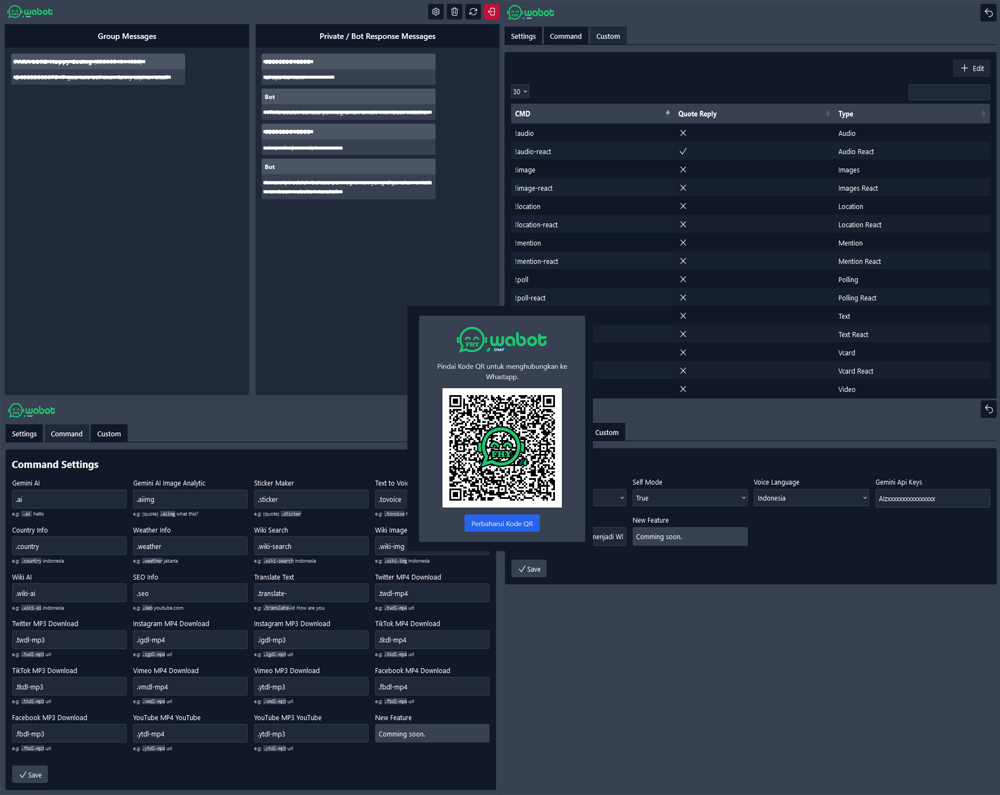

# Watsapp Bot UI

WhatsApp Bot UI offers a user-friendly and responsive interface for managing a WhatsApp bot, empowering users to manage conversations, adjust bot settings, and monitor real-time activity. The project is feature-rich, incorporating artificial intelligence, data retrieval, encryption, media downloading, and entertainment options.

### Features

```
🤖 Artificial Intelligence
├• Gemini AI - Provides advanced AI-driven functionalities.
└• Gemini AI Image Analytic - Analyzes images with AI for insights.

🌐 Wikipedia Integration
├• Wiki Search - Fetches Wikipedia articles.
├• Wiki Image - Retrieves images from Wikipedia.
└• Wiki AI - AI-based Wikipedia interaction.

🕌 Quran Resources
├• Surah - Access full Surah content.
└• Ayah Detail - Retrieves specific Ayah details.

🔒 Encryption Tools
├• AES Encrypt/Decrypt
├• Camelia Encrypt/Decrypt
└• SHA, MD5, Ripemd, Bcrypt Encryptions

📁 Media Downloader
├• Twitter MP4/MP3
├• Instagram MP4/MP3
├• TikTok MP4/MP3
├• Vimeo MP4/MP3
├• Facebook MP4/MP3
└• YouTube MP4/MP3

📺 Entertainment
├• Random Words of Wisdom
└• Random Quotes (e.g., Hecker, Dilan, Love Quotes)

💬 GROUP
├• Add & Kick Member
├• Change Title & Desc Group
├• Promote & Demote Member
├• Group Info
├• Welcome & Goodbye Greetings
├• Mention All
└• Lock & Unlock Chat

📦 Miscellaneous
├• Sticker Maker - Create stickers from images.
├• Text to Voice - Supports multiple languages.
├• Country & Weather Info - Fetches relevant data.
├• SEO Info - Provides SEO insights.
├• Website Screenshot - Captures full-page screenshots.
├• GitHub Stalker - View GitHub profiles.
├• OCR - Converts image text to editable text.
├• Word Counter - Counts words in text.
├• QR Code Generator - Generates QR codes.
├• Translate Text - Supports multiple languages.
├• File Search - Searches various file formats (e.g., PDF, DOC/X, XLS/X, etc.).
├• Content Moderation - Anti-badwords and anti-link features.
├• Product Price Comparison - Check and compare prices.
├• Custom Responses - Auto/manual response customization.
├• Tools Lockup (DNS, SSL, HTTP)
├• Domain Check Vulnerability
├• Certificate Maker
├• Wallpaper
├• FreePik
├• Ringtone
├• Youtube Search
├• Apps Search
├• BitCoin Data
├• Github Repository Search
└• New Features Comming soon ...
```

### Installation

```
git clone https://github.com/fitri-hy/whatsapp-bot-ui.git
cd whatsapp-bot-ui
npm install
```

### Running the Server

```
npm start
```

> If you like this WhatsApp Bot UI project, don't forget to give it a ⭐ star and fork it in our repository! Your support will be very meaningful and help us to continue developing more sophisticated and useful features.

### Change Log / Updates Features

> **Version 1.7**
> - [ADD] Ringtone
> - [ADD] Apps Search
> - [ADD] FreePik
> - [ADD] BitCoin Data
> - [ADD] Youtube Search
> - [ADD] Github Repository Search
> - [ADD] Welcome Greetings (Group)
> - [ADD] Goodbye Greetings (Group)
> - [ADD] Group Info (Group)
> - [ADD] Mention All (Group)

> **Version 1.6**
> - [ADD] Add Member in Group
> - [ADD] Kick Member in Group
> - [ADD] Change Title Group in Group
> - [ADD] Change Desc Group in Group
> - [ADD] Promote Member in Group
> - [ADD] Demote Member in Group
> - [ADD] DLock Chat in Group
> - [ADD] Unlock Chat in Group
> - [ADD] Self Mode Group Command
> - [ADD] Domain Check Vulnerability
> - [ADD] Tools Lockup (DNS, SSL, HTTP)
> - [ADD] Certificate Maker
> - [ADD] Wallpaper Generator

> **Version 1.5**
> - [ADD] File Search
> - [ADD] Product Price Comparison

> **Version 1.4**
> - [ADD] Anti-badwords
> - [ADD] Anti-link
> - [ADD] Media Downloader

> **Version 1.3**
> - [ADD] Random Words of Wisdom
> - [ADD] Random Quotes (e.g., Hecker, Dilan, Love Quotes)
 
> **Version 1.2**
> - [ADD] Sticker Maker
> - [ADD] Text to Voice
> - [ADD] Country & Weather Info
> - [ADD] SEO Info
> - [ADD] Website Screenshot
> - [ADD] GitHub Stalker 
> - [ADD] OCR
> - [ADD] Word Counter
> - [ADD] QR Code Generator
> - [ADD] Translate Text

> **Version 1.1**
> - [ADD] Custom Auto Response
> - [ADD] Manual Send Messages
> - [ADD] AES Encrypt/Decrypt
> - [ADD] Camelia Encrypt/Decrypt
> - [ADD] SHA, MD5, Ripemd, Bcrypt Encryptions
> - [FIX] Self Mode

> **Version 1.0**
> - [ADD] Gemini AI
> - [ADD] Gemini AI Image Analytic
> - [ADD] Wiki Search
> - [ADD] Wiki Image
> - [ADD] Wiki AI
> - [ADD] Surah
> - [ADD] Ayah Detail
> - [ADD] Self Mode Command
> - Initial Release
